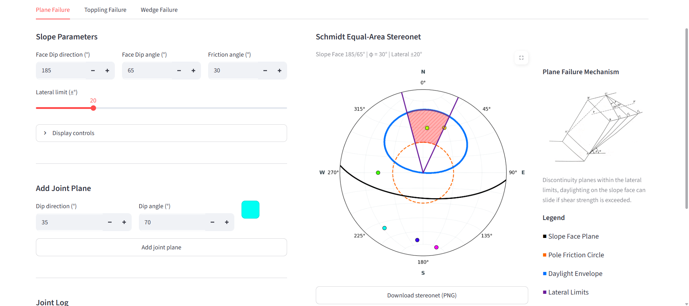
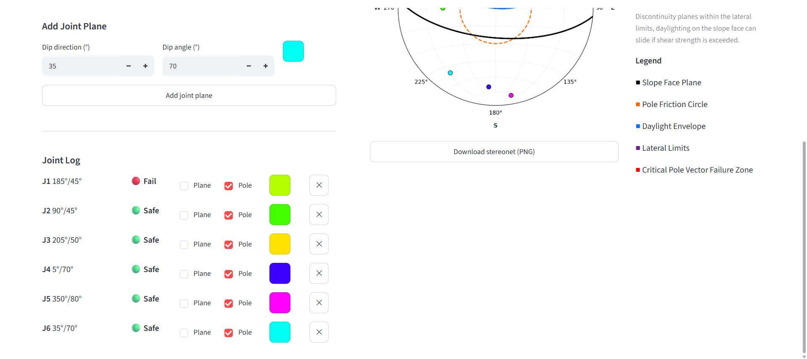
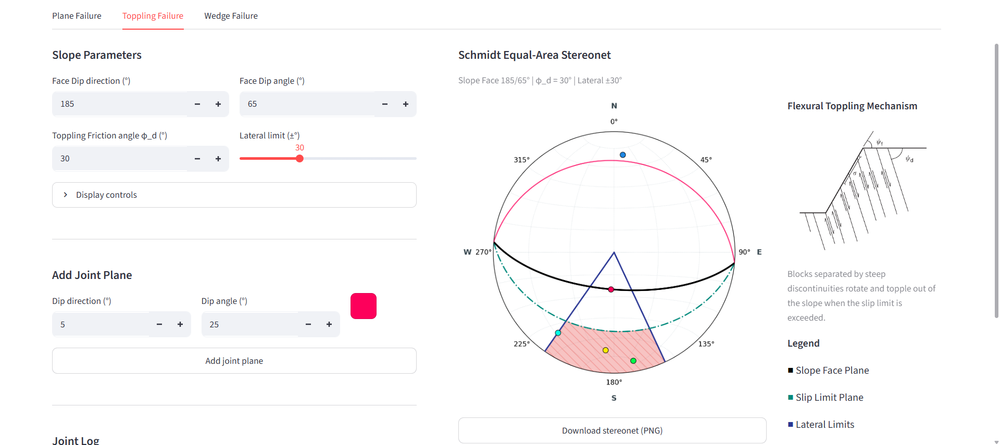
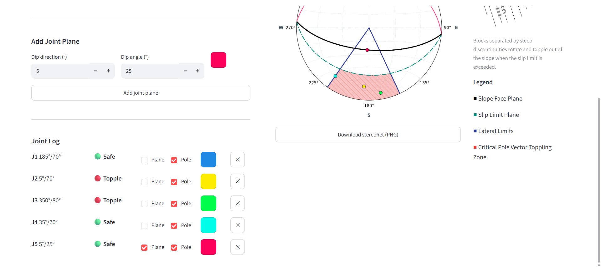
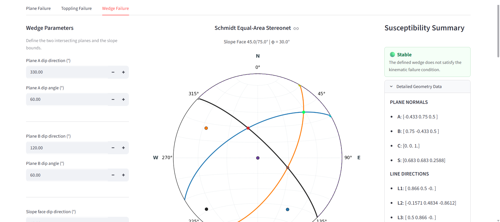
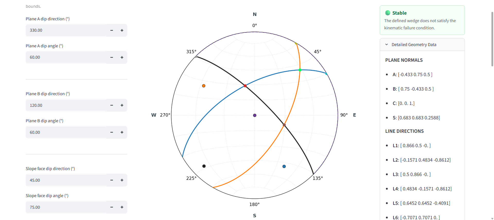

# Kinematic Slope Stability Toolkit

A Python **Streamlit** app for **kinematic stability analysis of rock slopes**. It helps assess whether common failure modes are *geometrically possible* using discontinuity orientations, slope geometry, and friction angle.

## Screenshots

### Plane failure
<table>
  <tr>
    <td></td>
    <td></td>
  </tr>
</table>

### Toppling failure
<table>
  <tr>
    <td></td>
    <td></td>
  </tr>
</table>

### Wedge failure
<table>
  <tr>
    <td></td>
    <td></td>
  </tr>
</table>

## Features

- Plane failure analysis
- Flexural toppling failure analysis
- Wedge failure analysis
- Schmidt stereonet visualization
- Clean Streamlit interface for interactive input and plotting

## What this tool does

This tool performs **kinematic feasibility analysis** for rock slope stability using the Markland test and Goodman-Bray criteria. It evaluates whether plane, wedge, or toppling failure modes are geometrically possible given the slope geometry, discontinuity orientations, and friction angle. The analysis produces a stereonet visualization showing the failure zones and joint poles, making it easy to identify kinematically critical discontinuities at a glance. However, kinematic analysis is inherently limited: it does **not** calculate factor of safety, model water pressure effects, account for block size or weight, or predict failure timing. It assumes dry conditions, uniform friction, and planar joints. Use this tool for early-stage screening and conceptual understanding of slope vulnerability; for critical applications or final design decisions, combine results with limit equilibrium or numerical analysis and site-specific geotechnical data.

## Inputs

All angle inputs are in **degrees**.

- **Slope face:** dip and dip direction
- **Discontinuity set(s):** dip and dip direction
- **Friction angle (φ)**

## Installation

```bash
pip install -r requirements.txt
```

## Requirements

- Python 3.8+
- Streamlit
- NumPy
- Matplotlib
- mplstereonet

## Local run

```bash
streamlit run app.py
```

## Assumptions

### Geometric / kinematic
- The rock mass is treated as rigid blocks; internal deformation is not considered
- Failure occurs only along pre-existing discontinuities, not through intact rock
- Joint sets are planar
- The slope face is planar
- The analysis is purely kinematic: it checks whether failure can occur geometrically, not whether it will occur

### Mechanical
- Friction angle (φ) is uniform and constant across joint surfaces
- Cohesion along discontinuities is assumed to be zero
- Friction angle input is a single value, with no spatial variability or uncertainty range

### Hydrological
- Dry conditions are assumed
- No pore water pressure, seepage forces, or rainfall infiltration are included

### Structural geology
- Joint orientations are treated as fixed point values
- No scatter in measured joint orientations is considered
- Joints within a set are assumed perfectly parallel

## Limitations

This tool is designed for **kinematic feasibility only**.

- It does not compute a factor of safety
- It does not predict failure timing
- It does not model progressive failure or time-dependent behaviour
- It does not estimate likelihood of failure, only geometric possibility

### Wedge failure
- The line of intersection of two planes is treated as the sliding direction
- Mixed-mode sliding on one plane only is not checked
- Wedge size and weight distribution are not considered

### Toppling
- Only simplified kinematic toppling criteria are considered
- Block toppling, secondary toppling, and complex interlayer behaviour may not be captured
- Block aspect ratios are not explicitly modelled

### Real-world conditions not modelled
- No dynamic loading such as earthquakes or blasting
- No weathering or long-term degradation of joint surfaces
- No scale effects
- No plan-view slope curvature
- No reinforcement or support elements such as bolts, anchors, or shotcrete

> A positive result means failure is **geometrically possible** under the stated assumptions, not that failure is certain or imminent. For full stability assessment, use limit equilibrium or numerical analysis with site-specific data.

## Main files

- `app.py` — Streamlit interface and app flow
- `src/geometry.py` — vector and angle utilities
- `src/mechanics.py` — failure checks
- `src/tetrahedron_logic.py` — wedge geometry engine
- `src/visualization.py` — stereonet plotting

## References & Acknowledgements

The kinematic principles, equations, and failure criteria utilized in this toolkit are derived from the following established geotechnical texts:

* **Wyllie, D. C., & Mah, C. W. (2004).** *Rock Slope Engineering: Civil and Mining* (4th ed.). Spon Press. (Based on original works by E. Hoek and J. W. Bray).
* **Deb, D., & Verma, A. K. (2016).** *Fundamentals and Applications of Rock Mechanics*. PHI Learning Pvt. Ltd.
* **Kliche, C. A. (2018).** *Rock Slope Stability* (2nd ed.). Society for Mining, Metallurgy & Exploration (SME).

> **Disclaimer:** Any diagrams, charts, or conceptual figures referenced or reproduced within this repository or application are strictly for educational, referential, and non-commercial purposes. All intellectual property rights belong to their respective authors and publishers.

## Author

**Aayush Kumar Lal** — [LinkedIn](https://www.linkedin.com/in/aayush-kumar-lal-4ba438322/) | [GitHub](https://github.com/aayushkumarlal50-dev)